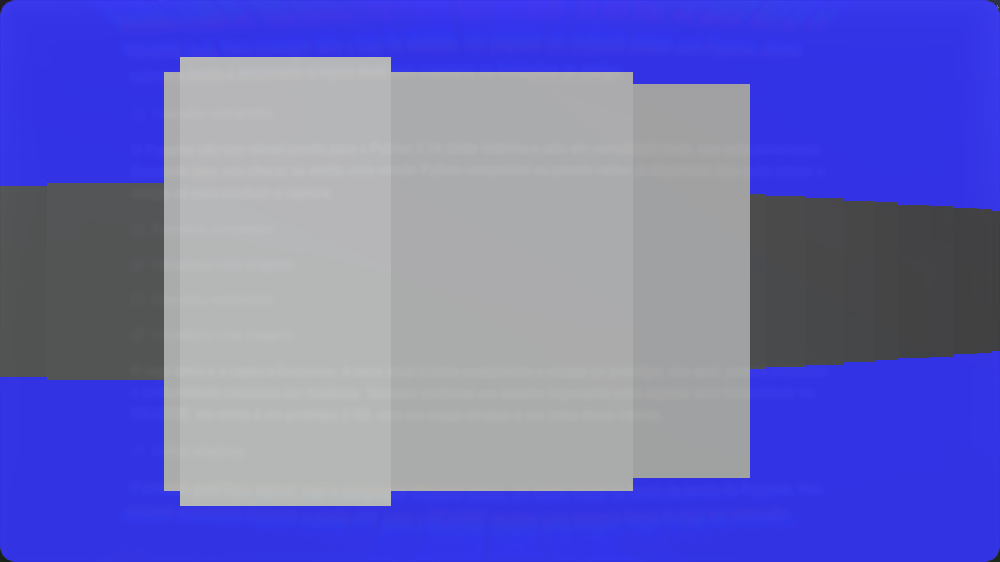

<div align="center">

# Raycasting Game

### Um pequeno laboratório em Python para transformar geometria 2D em uma experiência 3D.



<p>
  <a href="#como-executar">Executar</a> ·
  <a href="#controles">Controles</a> ·
  <a href="#como-o-raycasting-funciona">Como funciona</a>
</p>

</div>

Este projeto é um protótipo didático de raycasting feito com **Python** e **Pygame**. A ideia é enxergar como um mapa plano, algumas paredes e uma posição de jogador podem produzir uma cena com aparência tridimensional — sem usar um motor 3D.

## O que está acontecendo na tela?

O jogo começa com um jogador em um mapa 2D, um limite externo e um bloco interno. Para cada quadro, ele dispara vários raios dentro do campo de visão do jogador. Cada raio procura a primeira parede que encontra e transforma a distância até essa parede em uma faixa vertical.

O resultado é uma “parede” formada por muitas colunas lado a lado: quanto mais perto a colisão, maior a coluna; quanto mais longe, menor. É esse conjunto de fatias que cria a ilusão de profundidade.

## Como executar

```bash
git clone https://github.com/amendoa657/RaycastingGame.git
cd RaycastingGame

python3 -m venv venv
source venv/bin/activate
python -m pip install pygame
python Main.py
```

## Controles

| Tecla | Ação |
| --- | --- |
| `W` | Avançar |
| `S` | Recuar |
| `A` | Deslocar para a esquerda |
| `D` | Deslocar para a direita |
| `←` | Girar para a esquerda |
| `→` | Girar para a direita |
| Fechar a janela | Encerrar o jogo |

## Como o raycasting funciona

### 1. O mundo continua sendo 2D

O mapa não é uma malha 3D. As paredes são `pygame.Rect` no plano da tela:

```python
colisao = [
    pygame.Rect(0, 0, 50, altura),
    pygame.Rect(largura - 50, 0, 50, altura),
    pygame.Rect(0, 0, largura, 50),
    pygame.Rect(0, altura - 50, largura, 50),
]
bloco = pygame.Rect(300, 500, 100, 100)
```

O jogador também é apenas uma posição `(x, y)` e um ângulo de direção.

### 2. O campo de visão vira vários raios

Em `desenhar_raycast()`, o projeto percorre 180 ângulos. Como o código usa `ang / 2`, os raios cobrem aproximadamente 90 graus à frente do jogador:

```python
for ang in range(90, -90, -1):
    direcao = math.radians(rotate - ang / 2)
```

Cada raio representa uma coluna da imagem final. A coluna começa em `x = 0` e avança 10 pixels por iteração.

### 3. O raio avança até encontrar uma parede

O código testa pontos ao longo do raio, em passos de 10 pixels. A posição de cada ponto é calculada com seno e cosseno:

```python
end_pos = (
    playerRect.centerx + depth * math.cos(direcao),
    playerRect.centery - depth * math.sin(direcao),
)
```

Quando o ponto entra em uma parede, o percurso para. A variável `depth` passa a representar a distância aproximada entre o jogador e o obstáculo.

### 4. A distância vira altura na tela

A projeção usa uma relação simples de perspectiva:

```python
retangulo.height = ((ray_length * altura) / depth) / 8
```

O divisor `8` é um ajuste visual do protótipo. A regra essencial é:

```text
parede mais perto  → faixa mais alta
parede mais longe  → faixa mais baixa
```

Todas as faixas são centralizadas verticalmente e desenhadas em sequência. Vistas juntas, elas formam a parede com aparência 3D.

### 5. O jogador se move usando vetores

O movimento respeita o ângulo atual. Para avançar, o código usa o vetor `(cos(ângulo), -sin(ângulo))`; para recuar, usa o vetor oposto. O movimento lateral é o mesmo vetor girado em 90 graus.

Antes de confirmar o movimento, o projeto guarda a posição anterior e verifica se o jogador colidiu com uma parede externa. Se colidir, ele volta para a posição salva.

## Um pouco da história

Raycasting é uma técnica de **traçado de raios**: em vez de construir uma cena 3D completa, o programa lança linhas a partir de um ponto de observação e analisa o que cada linha encontra.

As experiências com mundos em primeira pessoa começaram muito antes dos jogos comerciais modernos. **Maze War**, criado nos anos 1970, já explorava a ideia de navegar por um labirinto em primeira pessoa. Na virada dos anos 1980 para 1990, computadores pessoais passaram a ter desempenho suficiente para transformar essa ideia em jogos mais fluidos.

O estilo ficou conhecido mundialmente com **Catacomb 3-D** (1991) e principalmente **Wolfenstein 3D** (1992), da id Software. Eles usavam uma forma otimizada de projeção por raios para desenhar corredores e paredes verticais em tempo real. O jogador enxergava um mundo 3D, mas a matemática por trás continuava essencialmente 2D.

Depois, jogos como **Doom** (1993) evoluíram para técnicas mais sofisticadas, usando setores, mapas de altura variável e estruturas como BSP. Ainda assim, o raycasting continua sendo uma das melhores portas de entrada para entender câmera, vetores, colisão, perspectiva e renderização.

## O que este protótipo ensina

- Como seno e cosseno formam vetores de movimento e visão.
- Como uma distância pode ser convertida em perspectiva.
- Como uma imagem 3D pode nascer de uma sequência de retângulos 2D.
- Como colisão e navegação podem existir sem um motor de física.
- Por que desempenho e organização do loop principal importam em renderização em tempo real.

## Próximos passos naturais

O projeto ainda é um experimento pequeno, o que deixa claras algumas evoluções possíveis:

- corrigir o efeito de “fish-eye” com uma correção pela diferença angular;
- usar uma matriz de mapa para criar várias paredes e salas;
- aplicar texturas e cores diferentes conforme o lado da parede atingido;
- adicionar colisão com o bloco interno;
- limitar o loop a 60 FPS usando `clock.tick(60)`;
- remover o `print()` executado a cada amostra de cada raio;
- separar mapa, jogador, câmera e renderizador em módulos menores.

O README anterior foi preservado em [`README.before-showcase.md`](README.before-showcase.md).
